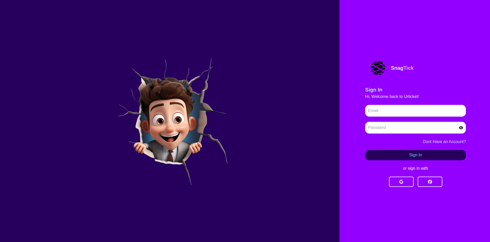
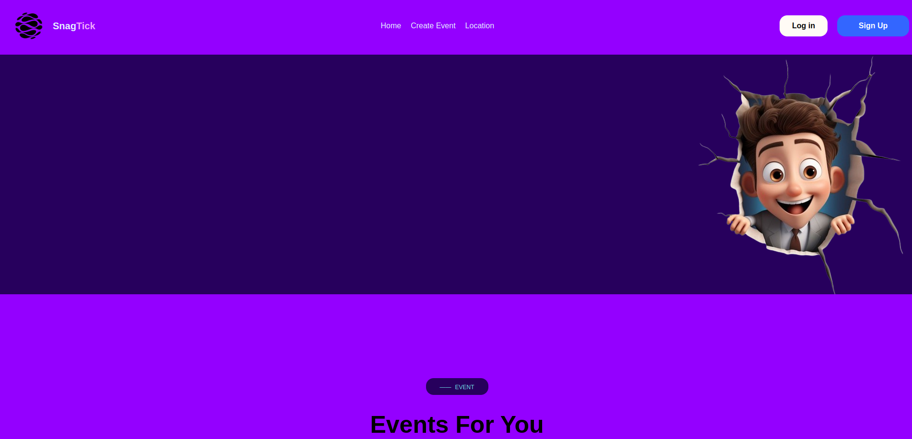
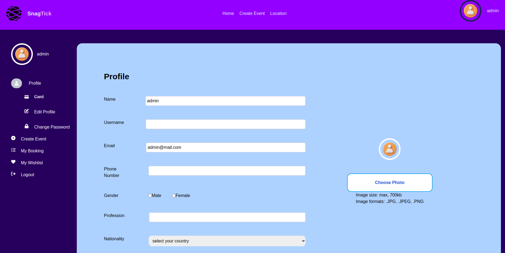
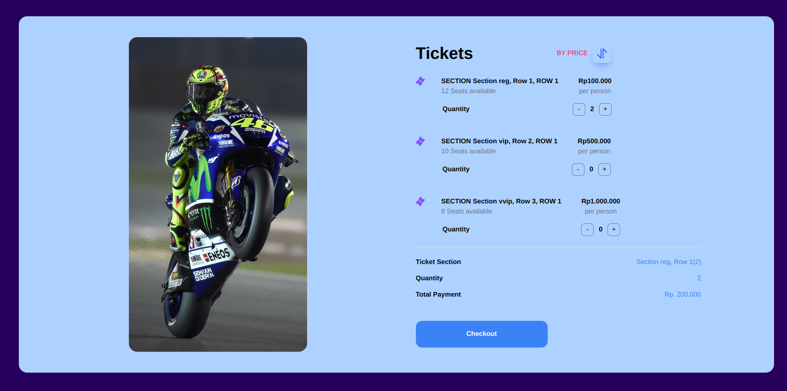
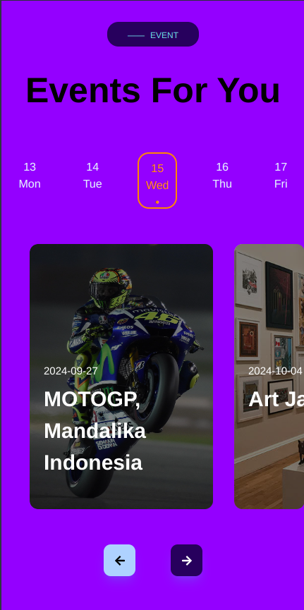

# SnagTick

Welcome to the **SnagTick**! This platform enables users to easily book tickets, purchase tickets, and create events. Built for efficiency and simplicity, **SnagTick** provides a seamless experience for both event organizers and attendees.


   
     
      
    

## Features

- **Browse Events**: Explore a list of available events with details.
- **Purchase Tickets**: Seamlessly buy tickets through a user-friendly interface.
- **Create Events**: Event organizers can set up and manage their events.
- **Responsive Design**: Fully optimized for both desktop and mobile users.

## Tech Stack

- **Frontend's Programming Language**:Javascript

- **Markup Language**:HTML,CSS
- **Libary/Framework**:React.js
- **Styling**: Tailwind CSS for responsive and modern design
- **Package Manager**: Node.js
- **Containerization**: Docker

#GETTING STARTED

1. Clone the repository:

   ```bash
   git clone https://github.com/ilyasalqordhowi/fgh21-react-event-organizer.git
   cd <project-name>
   ```

2. Run the program in VSCode:
   ```sh
   code .
   ```
3. Install dependencies:
   npm install

4. Run the program:

```sh
  npm run dev
```

5. Build an image in Docker using dockerfile

```sh
  docker build -t <images name> <dest>
```

6. Run the images in the Docker's Container

```sh
  docker run -d -p 21213:3000 --name <name container> <images name>
```
